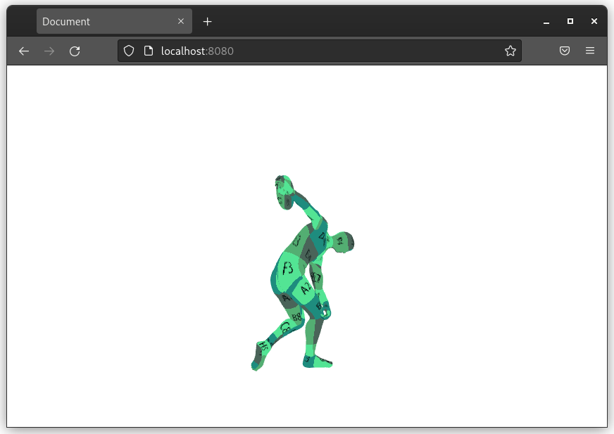

# webgl2-engine
Basic WebGL 2.0 engine playground to preview shaders
and rendering techniques.


## How to run
```
npm install
```

```
npm run serve
```

## Wishlist

* Deffered rendering
* SSAO
* Async loading of data
